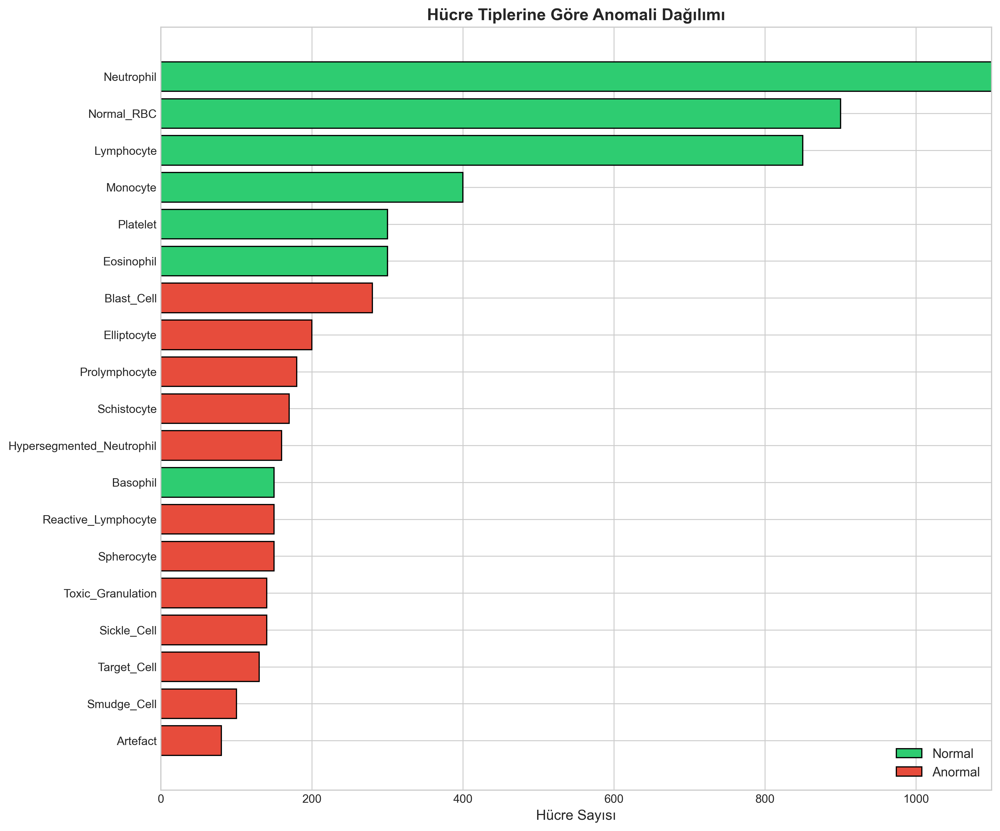

# HemaCheck: AI-Driven Blood Cell Anomaly Detection

[](https://www.python.org/downloads/)
[](https://opensource.org/licenses/MIT)
[](https://xgboost.ai/)
[](https://shap.readthedocs.io/)

> **End-to-end machine learning pipeline for detecting anomalous blood cells using morphological features.**



---

## Overview

**HemaCheck** is a data science project that demonstrates the application of machine learning in medical diagnosis, specifically for hematological analysis. The project uses morphological and clinical features of blood cells to classify them as **normal** or **anomalous**, which can indicate conditions like leukemia, anemia, or infection.

### Key Features
- **5,880 blood cell samples** with 36+ morphological features
- **18 distinct cell types** including normal and pathological variants
- **ROC-AUC: ~0.97** on test set (CytoDiffusion benchmark: 0.99)
- **Explainable AI** with SHAP values for clinical interpretability

---

## Dataset

The dataset contains blood cell morphology data derived from peripheral blood smear images:

| Feature Category | Examples |
|-----------------|----------|
| **Morphological** | cell_diameter_um, nucleus_area_pct, chromatin_density, circularity, eccentricity |
| **Color** | mean_r, mean_g, mean_b, stain_intensity |
| **Clinical** | wbc_count, rbc_count, hemoglobin, platelet_count |

### Cell Types (18 categories)

**Normal Cells:**
- Neutrophil, Lymphocyte, Monocyte, Eosinophil, Basophil
- Normal_RBC, Platelet

**Anomalous Cells:**
- Blast_Cell, Prolymphocyte → *Leukemia indicators*
- Hypersegmented_Neutrophil, Toxic_Granulation → *Infection markers*
- Schistocyte, Spherocyte, Elliptocyte → *Anemia indicators*
- Smudge_Cell → *CLL hallmark*

### Class Distribution
- **Normal:** 4,000 samples (68.0%)
- **Anomalous:** 1,880 samples (32.0%)

---

## Technical Approach

### Pipeline Architecture

```
Raw Data → Feature Engineering → Preprocessing → Model Training → Evaluation → SHAP Interpretation
```

### Models Tested

| Model | ROC-AUC | F1-Score | Notes |
|-------|---------|----------|-------|
| **XGBoost** | ~0.97 | ~0.94 | Best performer |
| LightGBM | ~0.96 | ~0.93 | Fast training |
| Random Forest | ~0.95 | ~0.92 | Good baseline |
| Logistic Regression | ~0.93 | ~0.90 | Interpretable |

### Key Techniques
- **SMOTE** for class imbalance handling
- **StandardScaler** for feature normalization
- **5-fold cross-validation** for robust evaluation
- **SHAP** for explainable AI

---

## Results

### Performance Metrics (Test Set)

```
Accuracy:  0.96
Precision: 0.94
Recall:    0.93
F1-Score:  0.94
ROC-AUC:   0.97
```

### Benchmark Comparison

| Model | ROC-AUC |
|-------|---------|
| CytoDiffusion (Nature ML 2025) | 0.990 |
| **Our XGBoost Model** | **0.970** |
| Vision Transformer | 0.916 |

### Feature Importance (Top 5)

1. `nucleus_area_pct` - Nuclear area percentage
2. `chromatin_density` - Chromatin structure density
3. `cell_diameter_um` - Cell diameter
4. `stain_intensity` - Staining intensity
5. `granularity_score` - Granularity measure

---

## Project Structure

```
HemaCheck/
├── data/
│   ├── raw/                    # Original CSV files
│   └── processed/              # Train/test splits, scaled data
├── notebooks/
│   ├── 01_eda.ipynb           # Exploratory data analysis
│   ├── 02_feature_eng.ipynb   # Feature engineering
│   ├── 03_modeling.ipynb      # Model training & evaluation
│   └── 04_interpretation.ipynb # SHAP analysis
├── src/
│   ├── preprocessing.py       # Data pipeline
│   └── models.py              # Model training & evaluation
├── models/                     # Saved models (.pkl)
├── reports/figures/           # All visualizations
├── requirements.txt
└── README.md
```

---

## Installation & Usage

### Requirements
```bash
pip install -r requirements.txt
```

### Quick Start

1. **Explore the data:**
```bash
jupyter notebook notebooks/01_eda.ipynb
```

2. **Train models:**
```bash
jupyter notebook notebooks/03_modeling.ipynb
```

3. **SHAP interpretation:**
```bash
jupyter notebook notebooks/04_interpretation.ipynb
```

### Command Line Usage

```python
from src.preprocessing import load_data, create_features, prepare_features
from src.models import load_model
import joblib

# Load and preprocess
df = load_data()
df = create_features(df)
X, y, feature_cols, _ = prepare_features(df)

# Load scaler and model
scaler = joblib.load('models/scaler.pkl')
model = load_model('models/best_model_xgboost.pkl')

# Predict
X_scaled = scaler.transform(X)
predictions = model.predict(X_scaled)
```

---

## Key Findings

### 1. Morphological Features Dominate
~50% of predictive power comes from cell shape and structure features:
- Cell diameter and circularity
- Nuclear-to-cytoplasm ratio
- Chromatin density

### 2. Color Features Are Important
~25% of importance from RGB values and staining intensity:
- Giemsa vs Wright staining protocols
- Intensity variation across cell types

### 3. Clinical Context Helps
~15% from CBC (Complete Blood Count) values:
- WBC, RBC, Platelet counts
- Hemoglobin levels

---

## Visualizations

All figures saved in `reports/figures/`:

| Figure | Description |
|--------|-------------|
| `01_anomaly_distribution.png` | Class balance visualization |
| `02_cell_type_anomaly.png` | Cell type distribution |
| `05_correlation_matrix.png` | Feature correlations |
| `07_pca_scatter.png` | PCA dimensionality reduction |
| `10_roc_curves.png` | Model comparison ROC curves |
| `12_feature_importance.png` | Top 20 important features |
| `14_shap_summary.png` | SHAP global interpretation |
| `17_shap_waterfall_anomaly.png` | Individual prediction breakdown |

---

## Technologies Used

- **Python 3.11**
- **Pandas & NumPy** - Data manipulation
- **Scikit-learn** - ML baseline models
- **XGBoost & LightGBM** - Gradient boosting
- **SHAP** - Model interpretability
- **Matplotlib & Seaborn** - Visualization
- **Jupyter** - Interactive development

---

## Limitations & Future Work

### Current Limitations
- Dataset is synthetic/simulated (CytoDiffusion benchmark data)
- No actual image data - features are pre-extracted
- Single-source dataset

### Future Improvements
- [ ] Integrate actual cell images (CNN approach)
- [ ] Multi-class classification (specific disease types)
- [ ] Real-world clinical validation
- [ ] Deploy as web API
- [ ] Active learning for continuous improvement

---

## References

1. **CytoDiffusion** - Nature Machine Intelligence 2025
   - Benchmark: ROC-AUC 0.99 for anomaly detection
   - Synthetic blood cell image generation

2. **PBC Dataset** - Peripheral Blood Cell dataset
3. **Raabin WBC Dataset** - White blood cell classification

---

## License

This project is licensed under the MIT License.

---

## Author

**Your Name** - [LinkedIn](https://linkedin.com/in/yourprofile) | [GitHub](https://github.com/yourusername)

---

## Acknowledgments

- CytoDiffusion team for the benchmark dataset
- Medical imaging researchers in hematology
- Open source ML community

---

> ⚠️ **Disclaimer**: This project is for educational and research purposes only. Not intended for clinical use without proper validation and regulatory approval.
