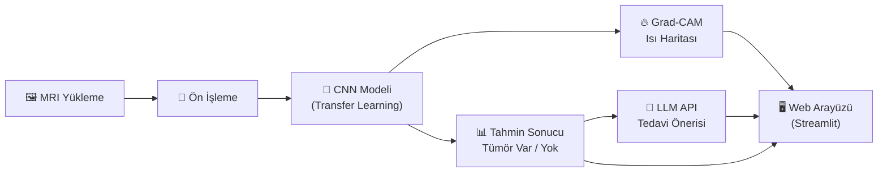
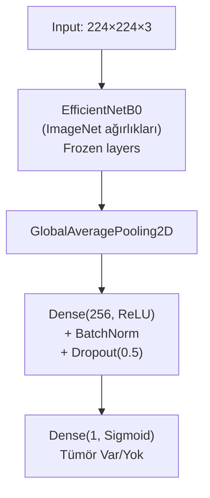
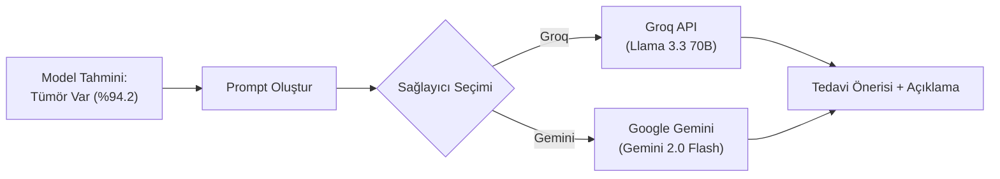
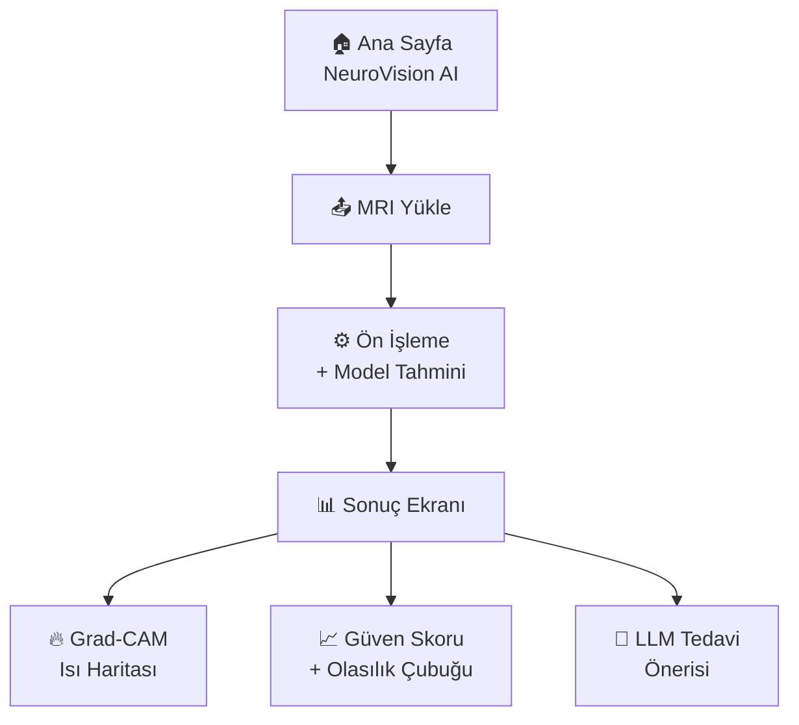
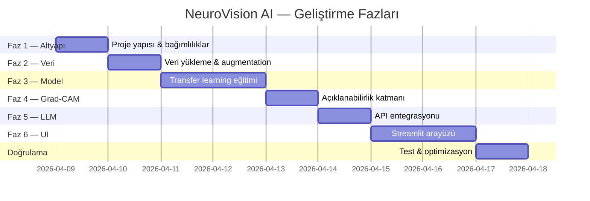

# 🧠 NeuroVision AI — Beyin Tümörü Tespit ve Tedavi Öneri Sistemi

## Proje Analizi ve Uygulama Planı

---

## 1. Veri Seti Analizi

### 1.1 Genel Bakış

| Özellik | Detay |
|---|---|
| **Konum** | `data/brain_tumor_dataset/` |
| **Sınıf Sayısı** | 2 (İkili Sınıflandırma) |
| **Pozitif Sınıf** (`yes/`) | 155 MRI görüntüsü — tümör **var** |
| **Negatif Sınıf** (`no/`) | 98 MRI görüntüsü — tümör **yok** |
| **Toplam Görüntü** | 253 adet |
| **Formatlar** | `.jpg`, `.jpeg`, `.png`, `.JPG` (karma) |
| **Boyut Aralığı** | ~3 KB – 727 KB (heterojen çözünürlükler) |
| **Dengesizlik Oranı** | 61% pozitif / 39% negatif |

### 1.2 Gözlemler

- **Sınıf Dengesizliği**: `yes` sınıfı `no` sınıfından ~1.58× fazla. Augmentation ve class-weight stratejileri gerekli.
- **Çözünürlük Farklılıkları**: Görüntüler farklı boyutlarda; tamamı ortak boyuta (ör. 224×224) yeniden ölçeklendirilmeli.
- **Format Karışıklığı**: Hem `.jpg` hem `.JPG` hem `.png` var; dosya okuma sırasında büyük/küçük harf duyarlılığı gözetilmeli.
- **Veri Miktarı**: 253 görüntü nispeten küçük bir veri seti → **Transfer Learning** zorunlu.

---

## 2. Proje Mimarisi (Üst Düzey)



### Katmanlar

| Katman | Teknoloji | Açıklama |
|---|---|---|
| **Veri Katmanı** | Python, OpenCV, PIL | Görüntü okuma, augmentation, ön işleme |
| **Model Katmanı** | TensorFlow/Keras, EfficientNetB0 | Transfer learning ile ikili sınıflandırma |
| **Açıklanabilirlik** | Grad-CAM, tf-keras-vis | Tümör bölgesini ısı haritasıyla gösterme |
| **LLM Entegrasyonu** | Groq API + Google Gemini API | Çoklu LLM sağlayıcı ile tedavi önerisi |
| **Web Arayüzü** | Streamlit | Kullanıcı dostu MRI yükleme ve sonuç ekranı |

---

## 3. Detaylı Uygulama Planı

### Faz 1 — Proje Altyapısı

#### [NEW] [requirements.txt](file:///c:/Coding/Antigravity/linkedin_projects/NeuroVision_AI/requirements.txt)
```
tensorflow>=2.15.0
opencv-python-headless>=4.9.0
Pillow>=10.2.0
numpy>=1.26.0
matplotlib>=3.8.0
scikit-learn>=1.4.0
streamlit>=1.31.0
groq>=0.5.0             # Groq API (Llama 3.3 / Mixtral)
google-generativeai>=0.5.0  # Google Gemini API
python-dotenv>=1.0.0
tf-keras-vis>=0.8.7
seaborn>=0.13.0
```

#### [NEW] [.env.example](file:///c:/Coding/Antigravity/linkedin_projects/NeuroVision_AI/.env.example)
```
# Her iki API anahtarını da ekleyin — Streamlit sidebar'dan seçim yapılır
GROQ_API_KEY=gsk-your-groq-key-here
GEMINI_API_KEY=your-gemini-key-here
```

#### Proje Klasör Yapısı
```
NeuroVision_AI/
├── data/
│   └── brain_tumor_dataset/
│       ├── yes/          # 155 tümörlü MRI
│       └── no/           # 98 sağlıklı MRI
├── models/               # Eğitilmiş model dosyaları (.h5 / .keras)
├── src/
│   ├── __init__.py
│   ├── data_loader.py    # Veri yükleme ve augmentation
│   ├── model.py          # CNN model tanımı (EfficientNetB0)
│   ├── train.py          # Eğitim betiği
│   ├── predict.py        # Tekil görüntü tahmini
│   ├── gradcam.py        # Grad-CAM ısı haritası üretimi
│   └── llm_advisor.py    # LLM tabanlı tedavi önerisi
├── app.py                # Streamlit web arayüzü
├── requirements.txt
├── .env.example
└── README.md
```

---

### Faz 2 — Veri Hazırlama (`src/data_loader.py`)

```python
# Ana işlevler:
# 1. Tüm görüntüleri 224×224 piksel boyutuna yeniden ölçeklendirme
# 2. Normalizasyon (0-1 aralığı)
# 3. Train / Validation / Test split (%70 / %15 / %15)
# 4. Data Augmentation (sadece train set):
#    - Yatay/dikey çevirme
#    - ±15° rotasyon
#    - ±10% zoom
#    - Parlaklık ayarı
# 5. class_weight hesaplama (dengesizlik telafisi)
```

> [!IMPORTANT]
> Veri seti küçük olduğu için aggressive augmentation ve k-fold cross-validation düşünülmeli.

---

### Faz 3 — Model Eğitimi (`src/model.py` + `src/train.py`)

#### Model Mimarisi: EfficientNetB0 + Transfer Learning



| Hiperparametre | Değer |
|---|---|
| **Base Model** | EfficientNetB0 (ImageNet) |
| **Optimizer** | Adam (lr=1e-4) |
| **Loss** | Binary Crossentropy |
| **Batch Size** | 16 |
| **Epochs** | 50 (EarlyStopping + ReduceLROnPlateau) |
| **Fine-tuning** | Son 20 katman açık, kalan dondurulmuş |

#### Eğitim Stratejisi
1. **İlk Aşama** (10 epoch): Tüm base model dondurulmuş, sadece üst katmanlar eğitilir
2. **Fine-tuning** (40 epoch): Son 20 katman açılır, düşük lr ile devam
3. **Callbacks**: `EarlyStopping(patience=7)`, `ModelCheckpoint`, `ReduceLROnPlateau`

---

### Faz 4 — Grad-CAM Açıklanabilirlik (`src/gradcam.py`)

Tümörün **nerede** tespit edildiğini görselleştirmek için Grad-CAM uygulanacak:

- Son konvolüsyon katmanından gradyan haritası çıkarılır
- Isı haritası orijinal MRI üzerine bindirilerek tümör lokalizasyonu gösterilir
- Doktorlara ve kullanıcılara **güven veren** açıklanabilir AI deneyimi sağlanır

---

### Faz 5 — LLM Tedavi Önerisi (`src/llm_advisor.py`)



#### Çoklu LLM Sağlayıcı Mimarisi

Kullanıcı Streamlit sidebar'dan LLM sağlayıcısını seçebilecek. Her ikisi de aynı prompt'u kullanacak:

| Sağlayıcı | Model | Avantaj | Kullanım |
|---|---|---|---|
| **Groq** | Llama 3.3 70B / Mixtral 8x7B | ⚡ Ultra-hızlı yanıt (~0.5s), ücretsiz tier | Varsayılan sağlayıcı |
| **Google Gemini** | Gemini 2.0 Flash | 🧠 Güçlü Türkçe, ücretsiz tier | Alternatif sağlayıcı |

#### LLM Prompt Stratejisi

```
Sen bir nöroloji uzmanısın. Bir beyin MRI görüntüsünden AI modeli 
aşağıdaki sonucu tespit etti:

- Tahmin: {Tümör VAR / YOK}
- Güven Oranı: {%XX.X}

Lütfen aşağıdaki başlıklar altında bilgi ver:
1. 🔬 Bu Sonucun Anlamı
2. 🏥 Önerilen Tıbbi Prosedürler
3. 💊 Olası Tedavi Yöntemleri
4. ⚠️ Önemli Uyarılar
5. 📋 Sonraki Adımlar

Yanıtını Türkçe ver ve hastaya yönelik anlaşılır bir dil kullan.

⚠️ UYARI: Bu bir AI tahminidir, kesin tanı değildir.
Her zaman bir nörolog/onkolog ile görüşülmelidir.
```

#### Fallback Stratejisi
- Birincil API başarısız olursa otomatik olarak diğer sağlayıcıya geçiş
- Her iki API de başarısız olursa önceden hazırlanmış statik tedavi bilgisi gösterilir

---

### Faz 6 — Web Arayüzü (`app.py` — Streamlit)

#### Kullanıcı Akışı



#### UI Bileşenleri

| Ekran | İçerik |
|---|---|
| **Sidebar** | Proje bilgisi, model metrikleri, ⚙️ **LLM sağlayıcı seçimi** |
| **Ana Panel** | MRI yükleme alanı (drag & drop) |
| **Sonuç Kartı** | Tahmin sonucu (✅ Sağlıklı / ⚠️ Tümör Tespit Edildi) |
| **Isı Haritası** | Orijinal MRI + Grad-CAM overlay (yan yana) |
| **Güven Barı** | İlerleme çubuğu ile yüzde gösterimi |
| **Tedavi Paneli** | LLM tarafından oluşturulan tedavi önerisi (expandable) |
| **Disclaimer** | Yasal uyarı — tıbbi tavsiye değildir |

---

## 4. Hedef Metrikler

| Metrik | Hedef |
|---|---|
| **Accuracy** | ≥ 92% |
| **Precision (Tümör)** | ≥ 90% |
| **Recall (Tümör)** | ≥ 95% (yanlış negatif minimize) |
| **F1-Score** | ≥ 92% |
| **AUC-ROC** | ≥ 0.95 |

> [!CAUTION]
> Tıbbi uygulamalarda **Recall** önceliklidir — tümörlü bir hastanın "sağlıklı" olarak tahmin edilmesi kritik bir hatadır.

---

## 5. Doğrulama Planı (Verification)

### Otomatik Testler

1. **Model Eğitimi Doğrulaması**:
   ```powershell
   cd c:\Coding\Antigravity\linkedin_projects\NeuroVision_AI
   python src/train.py
   ```
   - Eğitim/doğrulama kayıp grafiği oluşturulacak
   - Confusion matrix, classification report çıktısı kontrol edilecek

2. **Tekil Tahmin Testi**:
   ```powershell
   python src/predict.py --image data/brain_tumor_dataset/yes/Y1.jpg
   ```
   - Çıktı: `Tahmin: Tümör VAR | Güven: %XX.X`

3. **Grad-CAM Çıktı Kontrolü**:
   - Isı haritası görüntüsünün doğru üretildiği kontrol edilecek

### Manuel Doğrulama

1. **Streamlit Uygulamasını Başlat**:
   ```powershell
   streamlit run app.py
   ```
2. Tarayıcıda açılan sayfada:
   - `yes/` klasöründen bir MRI yükle → "Tümör Tespit Edildi" sonucu gelmeli
   - `no/` klasöründen bir MRI yükle → "Sağlıklı" sonucu gelmeli
   - Grad-CAM ısı haritasının tümör bölgesini işaret ettiğini gözle doğrula
   - LLM tedavi önerisi panelinde anlamlı Türkçe metin oluştuğunu kontrol et

---

## 6. Geliştirme Yol Haritası



---

## 7. Önemli Notlar

> [!WARNING]
> **Tıbbi Sorumluluk Reddi**: Bu sistem bir **karar destek aracıdır**, tıbbi tanı koyma aracı değildir. Tüm tahminler bir uzman doktor tarafından doğrulanmalıdır. Uygulama arayüzünde bu uyarı daima görünür olmalıdır.

> [!TIP]
> **LinkedIn Portfolio İpucu**: Proje README'sine eğitim metrikleri, Grad-CAM örnekleri ve demo GIF'leri ekleyerek etkileyici bir sunum hazırlanabilir.

---

## 8. Kullanıcıdan Onay Gereken Kararlar

1. ~~**LLM API Tercihi**~~ → ✅ **Karar verildi:** Groq + Gemini (her ikisi desteklenecek)
2. **Arayüz Dili**: Tamamen Türkçe mi, yoksa İngilizce arayüz + Türkçe LLM çıktısı mı?
3. **Ek Özellikler**: PDF rapor üretimi, geçmiş tarama kayıtları gibi özellikler eklensin mi?
